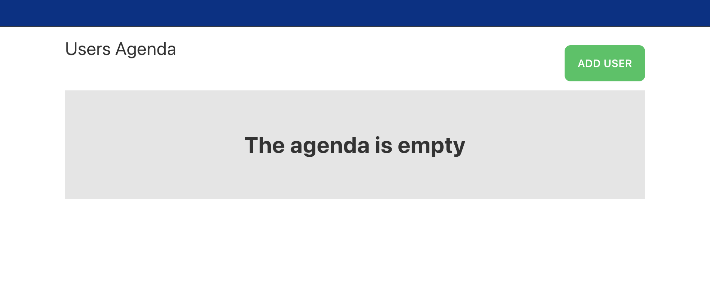
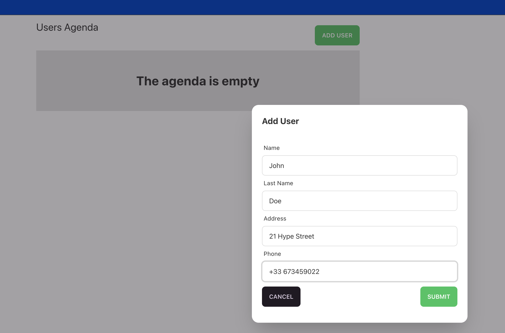
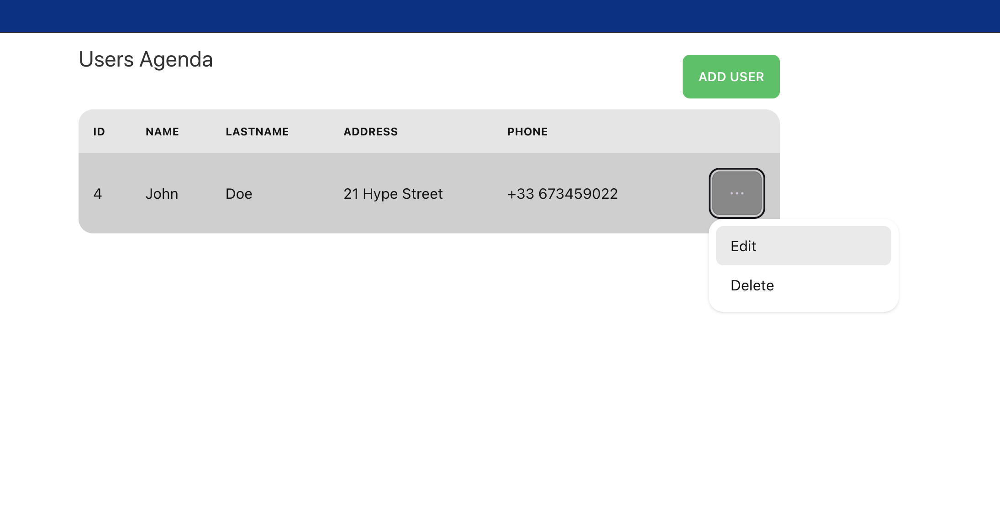
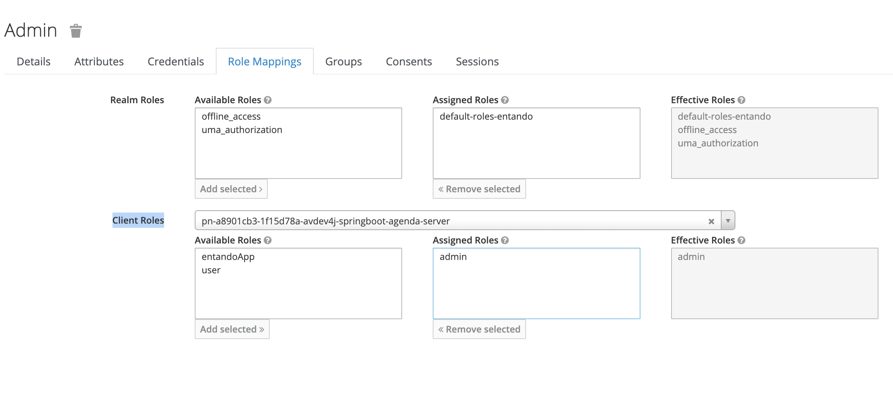

# Agenda Bundle Template

## Introduction
Welcome to the documentation for the agenda-bundle-template. This project is a pro-code bundle template, combining multiple components to help creators start a new bundle.
It includes a Java Spring Boot backend and three micro frontends, implemented using three different frameworks: Angular, React, and Vue.js.
## The components
### The Spring boot microservice
This microservice exposes an API to manage the agenda features. You access it from the `microservices/springboot-agenda` folder.
The endpoints are secured accordingly with the business rules, with Spring Security using annotations. 

```
@PostMapping("/contact")
@PreAuthorize("hasRole('admin')")
@SecurityRequirement(name = "agenda_auth")
public ResponseEntity<ContactRecord> createContact(@RequestBody ContactRecord contact) throws URISyntaxException {
    log.debug("REST request to create a NEW contact: {}", contact );

    ContactRecord created = contactService.save(contact);

    return ResponseEntity
            .created(new URI("/api/contacts/" + created.id()))
            .body(created);
}
```

You can access the Swagger-UI to test the API from this URL: [http://localhost:8081/swagger-ui/index.html]()

### The microfrontends
All three micro frontends provide a consistent user experience, with a similiar look and feel. So, you have the choice to choose which technology you want to start your composable journey.
The micro frontends are delivered with preconfigured API claims to work both locally and on the Entando Platform.

```
export const mfeconfig = {
    "systemParams": {
        "api": {
            "springboot-agenda-api": {
                "url": "http://localhost:8081"
            }
        }
    }
}
```
This doesn't require extra steps to work, but if you want to learn more about API claims, you can check our [official tutorial](https://developer.entando.com/v7.2/tutorials/create/ms/add-api-claim.html#prerequisites).

The agenda allows you to:
- access the users list:


- Add a new user:



- Edit or delete one:


Because Entando follows the philosophy of composition, all 3 microfrontends use TailwindCSS and DaisyUI (also applying a custom theme) with the goal of pushing composition to the most advanced levels and allowing developers to focus on developing functionality instead of reinventing the wheel.

## Create a bundle from the template
The purpose of this bundle is to provide users with a template or sample to kickstart their own application development.

The following documentation helps you to start using it as a template.
### Prerequisites
Before proceeding with the bundle creation process, ensure that you have the following prerequisites installed on your system:

1. Java Development Kit (JDK) - version 17
2. Node.js - version 14.20 or higher
3. NPM - Included with the Node version
4. Entando CLI v7.x

### Initialize Your Bundle
1. Open a terminal or command prompt.
2. Navigate to the directory where you want to create your bundle.
3. Run the following command to initialize your bundle, and select the "Agenda Bundle Templates" in the list:
```bash
ent bundle init my-bundle --from-hub --hub-url=http://pbcdev.k8s-entando.org/entando-hub-api/
```

### Services included
The current bundle provides two services: Keycloack and Posgresql. Use them to create your dev environment. These are not aimed to be used in production.
Start the services before starting the components
```bash
ent bundle svc start agenda-keycloak
```
```bash
ent bundle svc start agenda-postgresql
```

### Backend Configuration and Start
1. Open the project in your preferred Java IDE or text editor.
2. Customize the backend code and configurations according to your application requirements.
3. Start the Spring Boot backend application by running the following command in a terminal or command prompt:
```bash
ent bundle run springboot-agenda
```
> Please note, the springboot-agenda microservice requires both a Postgresql database and a Keycloak to run.
> This bundle provides a SVC to run them as container for development purposes.
> run `ent bundle svc start agenda-postgresql` and `ent bundle svc start agenda-keycloak`.

### Micro frontend Configuration and Build
1. For each micro frontend framework (Angular, React, and Vue.js):
- Open the corresponding micro frontend module in your preferred IDE or text editor.
- Customize the micro frontend code and configurations as per your application's needs.
2. Install the project dependencies and build the micro frontends by running the following command in a terminal or command prompt:
```bash
ent bundle run <mfe-name>
```
> Replace `<mfe_name>` with the name of the microfrontend you want to run. You can find the names in the entando.json file

If you want to run all the micro frontends using one command, use this command instead:
```bash
ent bundle run --all-mfe
```

### Optional: Remove Unwanted Microfrontends
If you don't need to keep all the three micro frontends implementations, you can easily remove them from the bundle by using the CLI:

1. Open a terminal or command prompt. 
2. Navigate to the project's root directory. 
3. Run the following command to remove a specific micro frontend:
```bash
ent bundle mfe rm MFE-NAME
```

Replace MFE-NAME with the name of the micro frontend you want to remove (e.g., vue-widget-agenda, angular-widget-agenda, react-widget-agenda).
Note: Be cautious when removing a micro frontend as it will permanently delete the corresponding files and configurations.

## Running on an Entando instance
To run the bundle on Entando for production requires an extra step compared to running it locally.
After [deploying and installing](https://developer.entando.com/v7.2/tutorials/create/pb/publish-project-bundle.html#create-and-deploy-a-bundle-project) your bundle, or installing the bundle from a hub, you have to configure Keycloak.
- Access to your Keycloak admin UI: https://YOUR-HOST-NAME/auth/
- Then open the "Users" menu, search for the relevant user (the user to be granted to use the agenda-bundle components), and click on the "Role Mappings" tab
- Then Select the bundle Client Roles in the "Client Roles" list
- Finally, add a role (Admin or User) to the user



## Conclusion
Feel free to explore the code and leverage this bundle as a sample or template for your future projects.

If you need further assistance or have any questions, please refer to the project documentation or reach out to our [Community Slack](https://join.slack.com/t/entandocommunity/shared_invite/zt-g609owdv-2K~YRh8zrI6lqlWo4aFWUw) for help.
